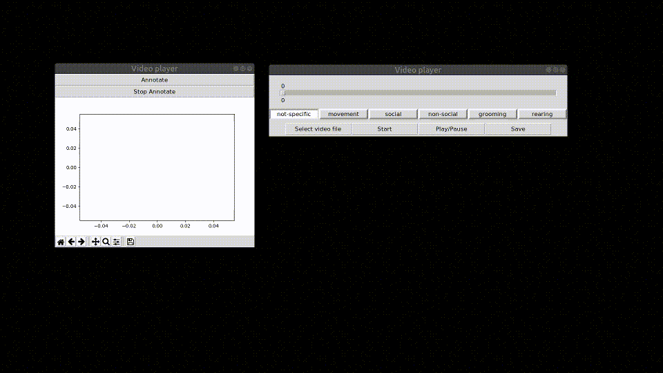

# annotate_behavior_video
This repository contains a very simple video annotator for animal behavior.


## Install

This software was built using python 3.4. You can get this software from the terminal using.

```
git clone https://github.com/matiasandina/annotate_behavior_video.git

```

To install dependencies.

```
pip3 install -r requirements.txt
```

You are advised to do this in a virtual environment. For example:

```
git clone https://github.com/matiasandina/annotate_behavior_video.git
cd annotate_behavior_video
python3 -m venv .annotator 
source .annotator/bin/activate
# some modules need numpy for install and you won't have it on a virtual environment
pip3 install numpy==1.22.0
pip3 install -r requirements.txt 
```

## Usage

The main function is `annotator.py`, which uses 2 windows. The main window will contain most buttons used to control the video. The second window provides visual feedback for annotation.

### Main window

From this window you control the reproduction, type annotation (aka, type of behavior) and saving of data.


### Ethogram window

From this window you can annotate the video and have a live ethogram representation of the annotations.


### Example

Here's an example showing minimal functions of the main app. 



## Next updates

Some updates will happen soon, this list contains the next things to be updated in order.

1. Allow for user to populate behavior categories at will on start-up.
	* Use `config.yaml` for this!
1. Add function `on_key_press` (allow hotkeys for scoring).
~~1. Add ask before quit.~~
1. Add colors/style to matplotlib.
1. Make GUI look pretty

## Other functions

This repository contains some functions used to capture an LED blink on video. Future versions may or may not contain this functionality and documentation will not be developed for these.

## Contribute

This is a preliminary release. Please file issues to make this software work better.